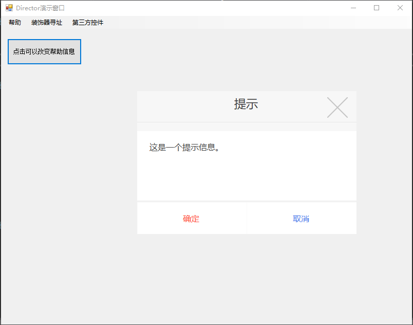

# DirectorEditor

基于winform实现的桌面应用开发框架.  
目前计划包含以下主要内容:  
1. 网络通信框架  
2. 组件库  
3. 容器注册服务  

## 框架的最终设计理念汇总:
### MVPFramework UI框架设计结构图:
               +--------------------------------------------------------------------------+                                             
               |                          MVPFramework                                    |                                             
               +--------------------------------------------------------------------------+                                             
                                                                                                                                        
               +-------------+                            +------------------------------+                                              
               |= Model Layer|                            |= Presenter Layer             |                                              
               |             |----------send------------->|+----------------------------+|                                              
               |             |                            ||                            ||                             |   |            
               |             |                            ||                            ||                    +---------   ----------+  
               +-------------+                            ||                            ||                    |= Presenter Stub      |  
                                                          ||      Presenter List        ||-----register------>|                      |  
                                                          ||                            ||                    +----------------------+  
                                                          ||                            ||                               |              
                                                          ||                            ||                               |              
                                                          |+----------------------------+|                               |              
                                                          +------------------------------+                               |              
                                                                          |                                              |              
                                                                          |                                              |              
                                                                          n                                              |              
                                                                          :                                              |              
                                                                          n                                              |              
                                                                          |                                              |              
                                                                          |                                              |              
                                                                          V                                              |              
      +---------------------------------------------------------------------------------+                                |              
      |= View Layer                                                                     |                                |              
      |  +-------------------------+                      +----------------------------+|                                |              
      |  |= View Component Layer   |                      |= View Logic Layer          ||                                |              
      |  |                         |                      |                            ||                                V              
      |  |                         |                      |                            ||                    +----------------------+   
      |  |                         |<--------1:1--------->|                            ||                    |= View Logic Stub     |   
      |  |                         |                      |                            ||-----register------>|                      |   
      |  |                         |                      |                            ||                    +----------------------+   
      |  |                         |                      |                            ||                                               
      |  +-------------------------+                      +----------------------------+|                                               
      |---------------------------------------------------------------------------------+                                               
优势如下:
1. 实现V层和P层的完全隔离
2. 完全的数据驱动. 利用Ioc,实现UI的依赖注入
3. 增加对P层的缓存结构, 提升显示界面显示时的效率

## 进度(设计思考流程过程在此记录)
### 2020.9.4 晚上
尝试接入第三方插件库【HZH_Controls】, 完美接入.  

### 2020.9.4 早晨  
在仔细思考了MVC、MVP等框架的设计理念之后, 对MVPFramework进行了迭代升级:  
               +--------------------------------------------------------------------------+                                             
               |                          MVPFramework                                    |                                             
               +--------------------------------------------------------------------------+                                             
                                                                                                                                        
               +-------------+                            +------------------------------+                                              
               |= Model Layer|                            |= Presenter Layer             |                                              
               |             |----------send------------->|+----------------------------+|                                              
               |             |                            ||                            ||                             |   |            
               |             |                            ||                            ||                    +---------   ----------+  
               +-------------+                            ||                            ||                    |= Presenter Stub      |  
                                                          ||      Presenter List        ||-----register------>|                      |  
                                                          ||                            ||                    +----------------------+  
                                                          ||                            ||                               |              
                                                          ||                            ||                               |              
                                                          |+----------------------------+|                               |              
                                                          +------------------------------+                               |              
                                                                          |                                              |              
                                                                          |                                              |              
                                                                          n                                              |              
                                                                          :                                              |              
                                                                          n                                              |              
                                                                          |                                              |              
                                                                          |                                              |              
                                                                          V                                              |              
      +---------------------------------------------------------------------------------+                                |              
      |= View Layer                                                                     |                                |              
      |  +-------------------------+                      +----------------------------+|                                |              
      |  |= View Component Layer   |                      |= View Logic Layer          ||                                |              
      |  |                         |                      |                            ||                                V              
      |  |                         |                      |                            ||                    +----------------------+   
      |  |                         |<--------1:1--------->|                            ||                    |= View Logic Stub     |   
      |  |                         |                      |                            ||-----register------>|                      |   
      |  |                         |                      |                            ||                    +----------------------+   
      |  |                         |                      |                            ||                                               
      |  +-------------------------+                      +----------------------------+|                                               
      |---------------------------------------------------------------------------------+                                               

其实, 传统的MVC等模式等模式并没有完全实现V层和C层的完全分离, 有的在V层甚至可以直接修改Model层的数据, 基于此, 主要做了以下改进:  
1. **将V层进一步划分为View Component Layer 和 View Logic Layer**  
  这样做的好处主要有:  
  a. 在View Component Layer上， 不进行任何业务逻辑的处理， UI设计可以完全移交给美术，并且业务逻辑不会受到UI迭代的影响  
  b. 可以自由嵌入第三方的组件库, 并且支持随时升级。 很多时候，我们都会去选择魔改第三方库以支持自己的业务，这种设计对第三方库无任何侵入式修改，便于维护  
2. **完全的数据驱动View层**  
  a. 为了严格做到各层之间的隔离, 防止因开发者的随意访问各层，而造成后期项目层之间的混乱  
  b. 作为开发者一方， 我们只关注数据和业务即可， 做到有变动即刷新  
3. **P层 和 V层 n:n 的对应关系**  
  传统的MVC、或则MVP框架, V层和C层、P层都是1:1关系, 主要会出现数据复制的情况:  
  a. 对于那些不会改动的数据, 每次重新显示界面的时候都会在C层或P层重新处理一遍  
  b. 如果多个界面用到同一份数据, 传统做法是将数据在每个C层或P层都赋值一份，然后重新处理一遍,效率比较低  
  c. 如果一个界面有多个数据源, 传统做法是将涉及到的所有Model都会放到C层去处理, 然后传递到V层.问题同上  
  因此,做了一下改进:  
  在P层做一次缓存(已做), 缓存的量级达到某一程度时, 触发清理过程(还没做). 清理过程就是根据GC那套思想, 不常用的先清理, 数据占用内存较大的先清理  

此外, 完善了View Logic Layer 和 Presenter Layer 绑定时的策略。 目前支持以下三种策略, 预计未来增加一种配置文件策略:  
- 装饰器策略  
- 标准命名策略  
- 组合策略  

9.2 的版本提到的DispatchCenter 概念正式替换为 Presenter Stub, 所有的Presenter 都可以在此访问.  

DirectorEditor 项目为演示工程  
目录结构如下:  
Models: 存储各种数据结构  
Presenters: 存储Presenter， 也就是业务逻辑处理层  
UIComponents: UI组件层, 不包含任何业务逻辑  
UILogic: UI业务逻辑层  
Views: ViewLogic 需要暴露给Presenter的接口集合  
PresenterStub：PresenterStub的全局访问中心  
ViewLogicStub: ViewLogicStub的全局访问中心(这个在未来不会对开发者开放直接访问权限)  

UI界面编写流程:  
1. 在UIComponents目录下创建组件  
2. 在Views目录下创建ViewLogic层需要暴露给Presenter层的接口  
3. 在UILogic目录下,编写界面的业务逻辑以及实现需要暴露个Presenter层的接口  
4. 在Presenters目录下,进行数据处理项目的业务逻辑, 如果有需要,在Models文件夹下定义数据结构  
5. 将ViewLogic和PresenteStub分别注册到全局访问中心  
6. 在需要的地方进行数据驱动即可  

### 2020.9.2  
MVPFramework 主体框架初步搭建完成  
 - M : Model层, 主要定义数据结构.  
 - P : Presenter层, 主要定义逻辑.  
 - V : View层, 主要控制视图的显示  

相比于传统的winform开发流程(View、逻辑、数据结构全部混在一起), MVPFramework将数据、逻辑、View进行了解耦合,利用C#的反射原理, 在View被初始化的时候,将Presenter与之绑定起来.  
Model层是一个可选的层, 因为有一些不需要与服务端、表格、数据库等数据源交互的界面，可以不用Model层。  

View和Presenter绑定原理  
允许自定义策略去实现绑定结构。 目前主要支持三种策略:  
- 装饰器策略  
- 标准命名策略  
- 组合策略  
所谓装饰器策略, 就是在View初始化的时候, 找到CustomAttribute， 如果是PresenterBinding类型, 则将此View和Presenter绑定起来  
标准命名策略, 也是在View初始化的时候, 根据固定命名规则在整个Assembly中找到相应的Presenter, 如果找到， 则将它们绑定起来  
组合策略, 就是上面的策略组合,找到一个之后， 立马结束。  

需要注意的是:   
Model ---> Presenter <-----> View  
View层需要重新填充内容有以下几种场景:  
- View初始化  
- Presenter接收到其绑定的数据  

调度中心 DispatchCenter  
传统的MVC等模式, 其Control层还是依赖于View层, 如果View层被回收了, 那么相应的Control层也没有了。  
原则上来说， 没什么问题， 但是Control层还有一个可以做但是不是必须做的内容 - 缓存。  
基于这一点思考了下,   
之前我们是这样去处理数据刷新的:  
从View层获取Control层 ---> 然后调用Control中的接口去处理数据 ---> 如果有改动，则通知View层去刷新  
其实在这个流程上, 第一步【从View层获取Control层】可以省略, 前提是需要我们设计一个独立的Control层，实现与View层的完全解耦合。  

